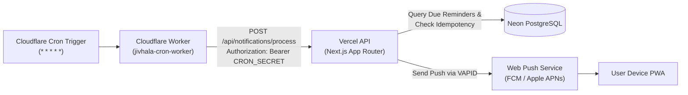

# Jivhala Cloudflare Worker Cron Scheduler ⏰

> **Dedicated Free-Tier Scheduler for Jivhala on Vercel Hobby + Neon**

---

## 🏗️ Architecture Overview



### Why This Architecture?
- **Vercel Hobby Plan Limit**: Vercel Cron on the Hobby (free) tier is restricted to at most once per day. Running every minute (`* * * * *`) requires Vercel Pro ($20/month).
- **Cloudflare Workers Free Tier**: Supports up to 3 Cron Triggers with unlimited executions under 100,000 requests/day. At 1 invocation per minute (1,440 requests/day), this uses **less than 1.5%** of Cloudflare's free daily quota, costing **$0/month forever**.
- **Security**: The Next.js endpoint remains protected with `Authorization: Bearer <CRON_SECRET>`. The secret is stored strictly in Cloudflare Worker Encrypted Secrets and Vercel Environment Variables.
- **Idempotency & Quiet Hours**: All business logic, quiet hours filtering (11:00 PM – 7:30 AM), timezone detection (`Asia/Kolkata`), and duplicate delivery protection remain safely inside your Next.js codebase.

---

## 📋 Required Variables in Cloudflare

| Variable Name | Type | Description | Example |
| :--- | :--- | :--- | :--- |
| `JIVHALA_APP_URL` | Environment Variable or Secret | Your live Jivhala Vercel domain | `https://jivhala-sujitjoshi258-gmailcoms-projects.vercel.app` |
| `CRON_SECRET` | **Encrypted Secret** | Same secret set in Vercel Project Settings | `jivhala_sec_...` |

---

## 🚀 Setup Instructions

You can set this up using either **Option A (Web Dashboard - No CLI)** or **Option B (Wrangler CLI)**.

---

### Option A: Via Cloudflare Web Dashboard (Fastest, 3 Minutes)

1. Log in to your [Cloudflare Dashboard](https://dash.cloudflare.com/).
2. In the left navigation, go to **Compute (Workers & Pages)** → click **Create application** → **Create Worker**.
3. Name your worker: `jivhala-cron-worker` → click **Deploy**.
4. Click **Edit code** (Quick Edit):
   - Replace the default code with the contents of [`cloudflare-worker/src/index.ts`](./src/index.ts) (or copy the code below).
   - Click **Deploy** in the top right.
5. Add the **Cron Trigger** (* * * * *):
   - Go to your Worker's dashboard → **Triggers** tab.
   - Under **Cron Triggers**, click **Add Cron Trigger**.
   - Select or enter Cron pattern: `* * * * *` (Runs every minute).
   - Click **Add Trigger**.
6. Add the **Environment Variables & Secrets**:
   - Go to the **Settings** tab → **Variables and Secrets**.
   - Under **Variables and Secrets**, click **Add**:
     - Name: `JIVHALA_APP_URL`
     - Value: `https://<your-vercel-domain>.vercel.app` (your actual Vercel deployment URL)
     - Type: Variable (or Encrypt)
     - Click **Save**.
   - Click **Add** again:
     - Name: `CRON_SECRET`
     - Value: `<your_cron_secret>` (must exactly match `CRON_SECRET` in your Vercel Project Settings)
     - Click **Encrypt** (marks as secret)
     - Click **Save**.
7. **Test the Worker**:
   - In your browser, open: `https://jivhala-cron-worker.<your-subdomain>.workers.dev/health`
   - It will return:
     ```json
     {
       "status": "ok",
       "service": "jivhala-cron-scheduler",
       "schedule": "* * * * *",
       "targetConfigured": true,
       "secretConfigured": true,
       "targetUrl": "https://..."
     }
     ```
   - To trigger an immediate test notification cycle: open `https://jivhala-cron-worker.<your-subdomain>.workers.dev/trigger` in your browser.

---

### Option B: Via Wrangler CLI

If you prefer deploying via terminal using Wrangler:

1. In your terminal, navigate to this directory:
   ```bash
   cd cloudflare-worker
   ```
2. Log in to your Cloudflare account:
   ```bash
   npx wrangler login
   ```
3. Set the secrets:
   ```bash
   # Set your Vercel deployment URL
   npx wrangler secret put JIVHALA_APP_URL
   # (Paste your URL, e.g. https://jivhala-sujitjoshi258-gmailcoms-projects.vercel.app)

   # Set your CRON_SECRET matching Vercel
   npx wrangler secret put CRON_SECRET
   # (Paste your CRON_SECRET)
   ```
4. Deploy the worker:
   ```bash
   npx wrangler deploy
   ```
5. Tail live execution logs:
   ```bash
   npx wrangler tail
   ```

---

## 🔍 Verification & Monitoring

- **Cloudflare Real-time Logs**: Go to Worker → **Live Logs** / **Real-time Logs** → click **Begin log stream**. Every 60 seconds you will see:
  ```text
  [Success] Jivhala scheduler returned HTTP 200 in 184ms: {"success":true,"totalSubscriptions":...}
  ```
- **Vercel Runtime Logs**: In your Vercel Project Dashboard → **Logs**, you will see `POST /api/notifications/process` requests every minute with status `200`.
- **Idempotency Guarantee**: If no reminders are due or if quiet hours are active, the endpoint safely logs and skips with zero overhead.
